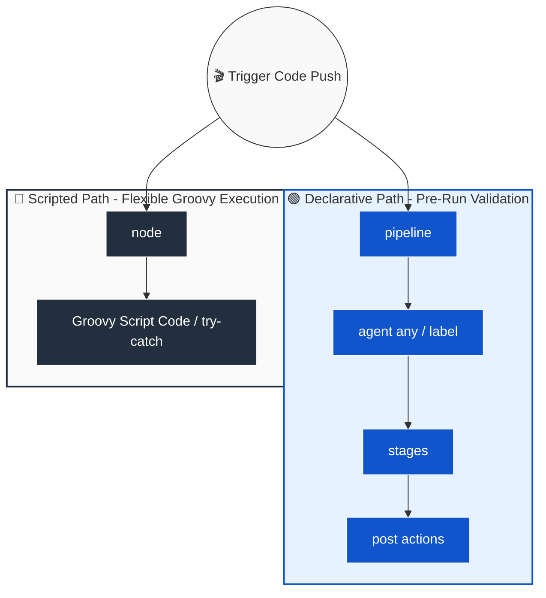

# 🚀 Jenkins Pipeline Complete Guide

## 📚 End-to-End CI/CD Automation Manual (Beginner → Advanced)
### ⚡ Declarative vs Scripted Syntax, Agent Mappings & Path Git Integrations

---

## 📖 1. Deep Theory: The Evolution of Jenkins Automation Pipelines

Production software lifecycle systems depend on automated execution blueprints rather than manual configuration steps. Jenkins addresses this paradigm via **Pipeline-as-Code**, enabling engineers to check their deployment workflow manifests straight into version control platforms alongside their primary codebase.

### 💡 Core Architectural Frameworks:
1. **Scripted Pipelines (Imperative):** Developed as the legacy engine standard using direct Apache Groovy runtime syntax scripts. It executes linearly inside explicit `node { }` tracking scopes and requires manual handling of exception trees via standard loops.
2. **Declarative Pipelines (Structured):** The modern, universally recommended configuration standard wrapper. It provides an easier, highly predictable predefined structural block template (`pipeline { }`). It checks syntax accuracy prior to run execution cycles to eliminate unexpected failures mid-run.
3. **Distributed Executor Nodes (Agents):** Pipelines leverage explicit `agent { label 'app-tag' }` constraints to prevent resource resource exhaustion on primary automation servers. This delegates actual script binaries compilation, testing, and Docker packaging processes to dynamic remote worker boxes safely.

---

## 🔥 2. Structural Code Blueprint Examples

### 🔹 Declarative Pipeline Syntax Template
```groovy
pipeline {
    agent { label 'agent' }
    stages {
        stage("pull") {
            steps { 
                echo "pulling code from git"
                git branch: 'main', url: 'https://github.com/mukundDeo9325/Project-InsureMe1.git'
            }
        }
        stage("build") {
            steps {
                echo "building the code"
            }
        }
        stage("test") {
            steps {
                echo "testing the code"
            }
        }
        stage("deploy") {
            steps {
                echo "deploying the code"
            }
        }
    }
}
```

### 🔹 Scripted Pipeline Syntax Template
```groovy
node {
    stage("pull") {
        echo "pulling code from git"
        git branch: 'main', url: 'https://github.com/mukundDeo9325/Project-InsureMe1.git'
    }
}
```

---

## 📌 1. Install Pipeline Plugin Ecosystem

The core Pipeline plugin engine is normally **pre-installed** out-of-the-box via the automated "Suggested Plugins" routine. If you need to manually inspect or install components, use these procedures:

### Implementation Steps
1. Navigate to the **Jenkins Dashboard** ───► **Manage Jenkins** ───► **Plugins** (or *Manage Plugins* on older setups).
2. Click the **Available Plugins** tab.
3. Search explicitly for **"Pipeline"**.
4. Check the configuration box beside **Pipeline** *(it is also recommended to check **Pipeline: Stage View** to generate neat UI visual tracker bars).*
5. Click **Install without restart** or select down-stream processing triggers to activate components safely on the next service reboot cycle.
6. Verify visibility under the **Installed Plugins** tab once the update pipeline concludes.

---

## 📌 2. Scripted Pipeline vs Declarative Pipeline Matrix

#### 🖼️ Structural Processing Flow Visualization:


#### 🖼️ Architecture Diagram (PNG Format Image Link):


| Technical Feature | Scripted Pipeline (Legacy Engine) | Declarative Pipeline (Modern Standard) |
| :--- | :--- | :--- |
| **Syntax Design** | Groovy-based, full programmatic flexibility | Strict structured, predefined JSON-like schema |
| **Introduction** | Jenkins 2.0 (Original Core Layout) | Later releases (The modern standard choice) |
| **Starting Block** | `node { }` | `pipeline { }` |
| **Learning Curve** | Steeper (Requires native Groovy syntax fluency) | Easier / highly beginner-friendly |
| **Error Handling** | Programmatic `try / catch / finally` blocks | Native descriptive `post { }` condition blocks |
| **Conditionals** | Pure Groovy `if / else` syntax maps | Standardized `when { }` evaluation rules |
| **Code Validation** | Runtime evaluation faults only (Crashes mid-run) | Early pre-run syntactic validation checks |
| **Optimal Use-Case** | Complex programming logic, dynamic runtime flows | Standard enterprise CI/CD release pipelines |

### 🛠️ Legacy Scripted Pipeline Code Block
```groovy
node {
    stage('Build') {
        echo 'Building...'
    }
    stage('Test') {
        echo 'Testing...'
    }
}
```

### 🛠️ Recommended Declarative Pipeline Code Block
```groovy
pipeline {
    agent any
    stages {
        stage('Build') {
            steps {
                echo 'Building...'
            }
        }
    }
}
```

---

## 📌 3. Basic 4-Stage Pipeline Scaffold

Below is a standard production layout configuring structural stage walls tracking applications cleanly across standard integration cycles:

```groovy
pipeline {
    agent any
    stages {

        stage('Pull') {
            steps {
                echo '⬇️ Pulling source code from Git...'
            }
        }

        stage('Build') {
            steps {
                echo '🔨 Building...'
            }
        }

        stage('Test') {
            steps {
                echo '🧪 Testing...'
            }
        }

        stage('Deploy') {
            steps {
                echo '🚀 Deploying...'
            }
        }

    }
}
```

---

## 📌 4. Integrated Pull Stage Implementations

The **Pull stage** acts as the initial root gatekeeper step of any functional pipeline workspace. It clones fresh source files from isolated repositories down onto the local execution disk before passing variables down onto later builder tools.

---

### ✅ Option A — Standard Repository Ingestion (Global Execution)

```groovy
pipeline {
    agent any
    stages {
        stage('Pull') {
            steps {
                echo '⬇️ Pulling source code from Git...'
                git branch: 'main', url: 'https://github.com/mukundDeo9325/terraform.git'
            }
        }

        stage('Build') {
            steps {
                echo '🔨 Building...'
            }
        }

        stage('Test') {
            steps {
                echo '🧪 Testing...'
            }
        }

        stage('Deploy') {
            steps {
                echo '🚀 Deploying...'
            }
        }
    }
}
```

---

### ✅ Option B — Targeted Worker Node Ingestion (Isolated Label Assignment)

Use this setup when specific build steps must resolve only on designated worker systems matching custom tags inside your cloud infrastructure networks.

```groovy
pipeline {
    agent { label 'project' }   // 'project' maps as the explicit agent execution tag rule
    stages {
        stage('Pull') {
            steps {
                echo '⬇️ Pulling source code from Git...'
                git branch: 'main', url: 'https://github.com/mukundDeo9325/terraform.git'
            }
        }

        stage('Build') {
            steps {
                echo '🔨 Building...'
            }
        }

        stage('Test') {
            steps {
                echo '🧪 Testing...'
            }
        }

        stage('Deploy') {
            steps {
                echo '🚀 Deploying...'
            }
        }
    }
}
```

---

## ⚠️ Common Production Pitfalls & Security Regulations
* **Missing Git Credentials Setup:** Public repositories clone seamlessly. However, if your target endpoint points to private business repositories, you must map the `credentialsId: 'your-credential-token-id'` string wrapper parameter straight inside the `git` step line.
* **Agent Label Typing Clashes:** If you assign an incorrect or non-existent executor label matching name inside the `agent { label '...' }` block, your pipeline execution task will hang permanently in a `Queueing` loop waiting for compatible node availability.

---

## 💡 Quick Syntax Reference Recap
* **`pipeline { }`** = Declarative root entry boundary wrapper.
* **`agent any`** = Instructs Jenkins to handle files on any active host system.
* **`stage('Name')`** = Separates execution boundaries visually inside the Stage View dashboard.
